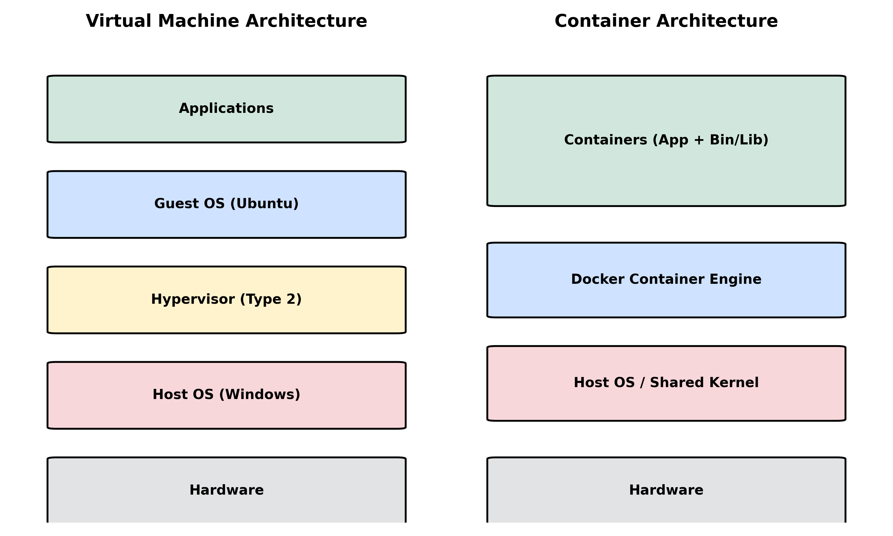
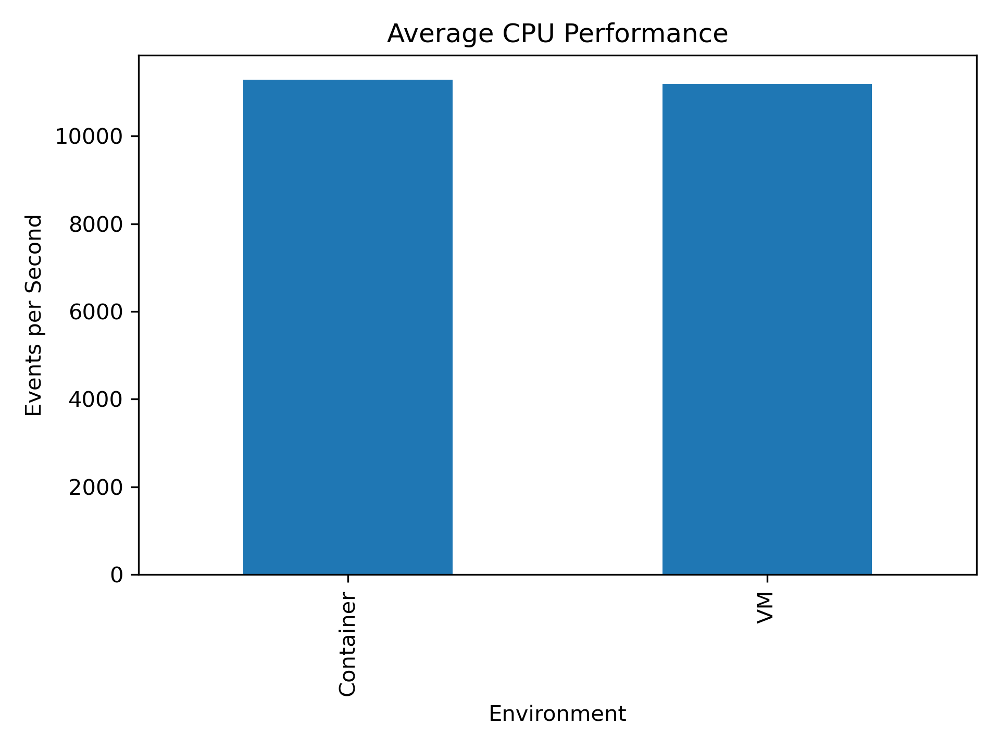
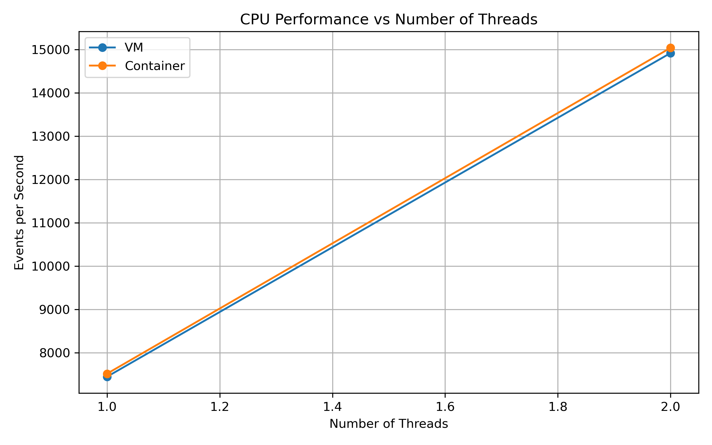

# Performance Analysis of Virtual Machines and Containers

> Experimental comparison of the performance, resource utilization, application performance, and scalability of Virtual Machines (VMware Workstation + Ubuntu) and Docker Containers under identical workloads.

---

## Abstract

This project experimentally compares a Virtual Machine environment (Ubuntu guest on VMware Workstation) with a Docker container environment by running identical workloads in both. The workloads cover CPU (Sysbench), memory (Sysbench), disk I/O (fio), network (iperf3), a FastAPI web application (Apache Benchmark / wrk), startup time, and scalability under increasing load. Every experiment is repeated multiple times, raw outputs are stored unaltered, and results are processed with Python (Pandas, Matplotlib) to obtain mean, median, min, max, and standard deviation. The conclusions are based only on the measured data.

<!-- TODO: After finishing the experiments, add 2-3 sentences summarizing the key findings (e.g., which environment performed better in which workload, and by what percentage). -->

---

## Objectives

- Prepare and document a controlled experimental environment for VM and container testing.
- Establish a baseline using a common CPU workload.
- Measure and compare CPU, memory, disk I/O, and network performance.
- Compare application-level performance using a FastAPI service.
- Measure application and environment startup time.
- Study scalability as workload (threads / concurrent connections) increases.
- Automate benchmarks and process results using CSV files and Python.
- Publish scripts, raw data, graphs, and documentation on GitHub so the experiment is reproducible.

---

## Research Questions

1. How does CPU performance (events/sec, execution time) differ between a VM and a container?
2. How does memory throughput and latency differ between the two environments?
3. How do sequential and random disk read/write performance (MB/s, IOPS, latency) differ?
4. How do network throughput and retransmissions differ?
5. How does a realistic application (FastAPI) perform in terms of requests/sec, latency, and failed requests?
6. Which environment starts faster (environment startup and application-ready time)?
7. How does each environment scale as the number of threads or concurrent connections increases?

---

## Experimental Environment

```
┌───────────────────────────────────────────────┐
│            EXPERIMENTAL ENVIRONMENT           │
├───────────────────────────────────────────────┤
│ Host OS         →  Windows                    │
│ Hypervisor      →  VMware Workstation         │
│ Guest OS        →  Ubuntu                     │
│ Container       →  Docker                     │
│ Programming     →  Python                     │
│ CPU Benchmark   →  Sysbench                   │
│ Disk Benchmark  →  fio                        │
│ Network         →  iperf3                     │
│ API             →  FastAPI                    │
│ Analysis        →  Pandas / Matplotlib        │
└───────────────────────────────────────────────┘
```

---

## Hardware Configuration

### Host machine

| Item | Value |
|------|-------|
| CPU model | `<fill from docs/cpu-info.txt>` |
| Physical cores / threads | `<fill>` |
| RAM | `<fill>` |
| Storage type (SSD/HDD/NVMe) | `<fill>` |
| Host OS | Windows `<version>` |

### VM configuration (fixed allocation)

| Item | Value |
|------|-------|
| vCPU | `<e.g., 4>` |
| Memory | `<e.g., 8 GB>` |
| Virtual disk | `<e.g., 60 GB>` |
| Guest OS | Ubuntu `<e.g., 24.04 LTS>` |
| Network adapter | `<NAT or Bridged>` |

### Container configuration (controlled limits)

| Item | Value |
|------|-------|
| CPU limit | `<e.g., --cpus=4>` |
| Memory limit | `<e.g., --memory=8g>` |
| Base image | `ubuntu:24.04` |
| Storage | `<host directory / Docker volume used>` |
| Network mode | `<bridge / host>` |

Raw system information is stored in `docs/cpu-info.txt`, `docs/memory-info.txt`, `docs/storage-info.txt`, `docs/kernel-info.txt`, and `docs/vm-configuration.txt`.

---

## Software Configuration

| Software | Purpose | Version |
|----------|---------|---------|
| Ubuntu | Guest OS / container base | `<fill>` |
| VMware Workstation | Hypervisor | `<fill>` |
| Docker | Container runtime | `<docker --version>` |
| Sysbench | CPU and memory benchmark | `<sysbench --version>` |
| fio | Disk I/O benchmark | `<fio --version>` |
| iperf3 | Network benchmark | `<iperf3 --version>` |
| Python | Analysis and API | `<python3 --version>` |
| FastAPI / Uvicorn | Application workload | `<pip show fastapi uvicorn>` |
| Apache Benchmark (ab) / wrk | HTTP load testing | `<fill>` |
| Pandas / Matplotlib / NumPy | Result analysis | `<fill>` |

---

## Architecture

```
              PERFORMANCE ANALYSIS
                      │
        ┌─────────────┴─────────────┐
        │                           │
     VIRTUAL                    CONTAINER
     MACHINE                      Docker
        │                           │
        └─────────────┬─────────────┘
                      │
                SAME WORKLOADS
                      │
        ┌─────────────┼─────────────┐
        ▼             ▼             ▼
       CPU         Memory     Disk / Network
                      │
                      ▼
               APPLICATION TEST
                      │
                      ▼
                FINAL ANALYSIS
```



---

## Methodology

- The **same workload and parameters** are executed in both the VM and the container.
- VM resources are fixed; the container is limited with `--cpus` and `--memory` to match.
- Each experiment is repeated **10 times** to reduce the effect of temporary fluctuations.
- Complete raw outputs are saved in `results/raw/`; they are never edited.
- Cleaned values go into `results/processed/*.csv` and are analyzed with Python.
- Percentage differences are computed with a consistent formula:

  - Execution time: `((vm_time - container_time) / vm_time) × 100`
  - Throughput: `((container_throughput - vm_throughput) / vm_throughput) × 100`

- No assumption is made beforehand that either environment performs better.

Full details: [`docs/methodology.md`](docs/methodology.md)

---

## CPU Experiment

| Parameter | Value |
|-----------|-------|
| Tool | Sysbench |
| Workload | Prime number calculation |
| `--cpu-max-prime` | 20000 |
| Threads | 1 / 2 / 4 / 8 |
| Duration | 30 seconds |
| Repetitions | 10 |
| Metrics | Events/sec, execution time |

```bash
sysbench cpu --cpu-max-prime=20000 --threads=4 --time=30 run
```

Container:

```bash
docker run --rm --cpus=4 --memory=8g vm-container-benchmark \
  sysbench cpu --cpu-max-prime=20000 --threads=4 --time=30 run
```

Raw data: `results/raw/cpu/` · Processed data: `results/processed/cpu_results.csv`

---

## Memory Experiment

| Parameter | Value |
|-----------|-------|
| Tool | Sysbench |
| Block size | 1M |
| Total size | 10G |
| Threads | 4 |
| Repetitions | 10 |
| Metrics | Operations/sec, throughput (MiB/s), latency |

```bash
sysbench memory --memory-block-size=1M --memory-total-size=10G --threads=4 run
```

Resource usage during the run is monitored using `htop`, `vmstat 1`, and `docker stats`.

Raw data: `results/raw/memory/`

---

## Disk I/O Experiment

| Parameter | Value |
|-----------|-------|
| Tool | fio |
| Test file size | 2G |
| Direct I/O | `--direct=1` |
| IO depth | 16 |
| Runtime | 30 s (time-based) |
| Tests | Sequential read/write (1M blocks), random read/write (4k blocks) |
| Metrics | MB/s, IOPS, latency |

```bash
fio --name=seq-write --filename=~/fio-test/testfile --size=2G --bs=1M \
    --rw=write --direct=1 --iodepth=16 --runtime=30 --time_based
```

Container (host directory mounted with `-v`):

```bash
docker run --rm -v ~/fio-test:/fio-test vm-container-benchmark \
  fio --name=seq-write --filename=/fio-test/testfile --size=2G --bs=1M \
      --rw=write --direct=1 --iodepth=16 --runtime=30 --time_based
```

Raw data: `results/raw/disk/`

> Storage placement (host directory vs. Docker volume) is documented because it can change measured results.

---

## Network Experiment

| Parameter | Value |
|-----------|-------|
| Tool | iperf3 |
| Duration | 30 s |
| Streams | 1 and 4 (`-P 4`) |
| Metrics | Throughput, retransmissions |
| Network mode | `<NAT / Bridged / host / bridge>` |

```bash
# Server
iperf3 -s

# Client
iperf3 -c <SERVER-IP> -t 30
iperf3 -c <SERVER-IP> -t 30 -P 4
```

Raw data: `results/raw/network/`

---

## Application Experiment

A FastAPI application (`api/main.py`) with three endpoints is run identically in the VM and in Docker:

| Endpoint | Purpose |
|----------|---------|
| `/health` | Lightweight health check |
| `/compute` | CPU-intensive loop (1,000,000 iterations) |
| `/memory` | Memory allocation (list of 1,000,000 integers) |

Load testing:

```bash
ab -n 10000 -c 100 http://127.0.0.1:8000/health
ab -n 1000  -c 10  http://127.0.0.1:8000/compute
wrk -t4 -c100 -d30s http://127.0.0.1:8000/health
```

Metrics recorded: requests per second, time per request, failed requests, connection times.

Docker image: `performance-api` (built from `api/Dockerfile`).

---

## Startup-Time Experiment

Measures how quickly the environment and the application become ready.

```bash
time docker run --rm -d --name startup-test -p 8000:8000 performance-api
docker stop startup-test
```

| Item | VM | Container |
|------|----|-----------|
| Environment startup | `<seconds>` | `<seconds>` |
| Application ready | `<seconds>` | `<seconds>` |

Multiple repetitions are performed because startup time varies.

---

## Scalability Experiment

| Test | Levels |
|------|--------|
| CPU (Sysbench threads) | 1 → 2 → 4 → 8 |
| API (wrk) | `-t1 -c10` → `-t2 -c50` → `-t4 -c100` → `-t4 -c200` |

Throughput, latency, CPU usage, and memory usage are recorded at each workload level.

---

## Results

> Populate only with actual measured values. Include units (seconds, MB/s, IOPS, Mbps, requests/sec, ms).

### CPU

| Threads | VM (events/s) | Container (events/s) |
|---------|---------------|----------------------|
| 1 | `<value>` | `<value>` |
| 2 | `<value>` | `<value>` |
| 4 | `<value>` | `<value>` |
| 8 | `<value>` | `<value>` |




### Memory, Disk, Network, Application, Startup, Scalability

Add the corresponding tables and graphs from `results/processed/` and `results/figures/`.

---

## Statistical Analysis

For each metric, the following statistics are calculated over the repeated runs using Pandas:

| Statistic | Meaning |
|-----------|---------|
| Mean | Average performance across runs |
| Median | Reduces the influence of outliers |
| Min / Max | Range of observed values |
| Standard deviation | Run-to-run variation |

```python
summary = df.groupby("environment")["events_per_second"].agg(
    ["mean", "median", "min", "max", "std"]
)
```

Analysis scripts: `scripts/analyze_results.py`, `scripts/generate_plots.py` · Notebook: `analysis/analysis.ipynb`

| Environment | Mean | Median | Min | Max | Std |
|-------------|------|--------|-----|-----|-----|
| VM | `<value>` | `<value>` | `<value>` | `<value>` | `<value>` |
| Container | `<value>` | `<value>` | `<value>` | `<value>` | `<value>` |

---

## VM vs Container Comparison

| Metric | VM | Container | Difference |
|--------|----|-----------|------------|
| CPU Performance | `<actual>` | `<actual>` | `<calculated %>` |
| Memory Usage | `<actual>` | `<actual>` | `<calculated %>` |
| Sequential Read | `<actual>` | `<actual>` | `<calculated %>` |
| Sequential Write | `<actual>` | `<actual>` | `<calculated %>` |
| Random Read | `<actual>` | `<actual>` | `<calculated %>` |
| Random Write | `<actual>` | `<actual>` | `<calculated %>` |
| Network Throughput | `<actual>` | `<actual>` | `<calculated %>` |
| Startup Time | `<actual>` | `<actual>` | `<calculated %>` |
| API Requests/sec | `<actual>` | `<actual>` | `<calculated %>` |
| API Latency | `<actual>` | `<actual>` | `<calculated %>` |

---

## Discussion

<!-- Write after analysis. Suggested points: -->

- Which environment performed better in each workload, and why (shared host kernel vs. hypervisor layer, virtualized disk and network, resource limits).
- Whether differences are larger than the run-to-run standard deviation (i.e., meaningful).
- Disk and network results in light of the storage placement and network mode used.
- Startup-time behavior and its implications for microservices and rapid deployment.
- Scalability trends as threads and connections increase.

---

## Limitations

- Results depend on the specific host hardware and configuration.
- The VM runs on a Windows host with VMware Workstation, while Docker runs inside the Ubuntu environment, so nested layers may affect results.
- Storage placement and network mode (NAT/Bridged/bridge/host) can change outcomes.
- Synthetic benchmarks and a simple FastAPI app may not represent all production workloads.
- Background host activity can introduce noise despite repeated runs.
- `<add any other limitation observed during your experiments>`

---

## Conclusion

<!-- Base the conclusion strictly on measured data, repeated runs, and statistical analysis. Do not assume beforehand that VMs or containers perform better. -->

`<Summarize the findings here after completing the experiments.>`

---

## Future Work

- Extend the experiments to Kubernetes (replicas and autoscaling).
- Test additional workloads (databases, multi-container apps).
- Compare other hypervisors and container runtimes.
- Evaluate different storage drivers and network modes.
- Add long-duration and mixed-workload tests.

---

## Reproduction Instructions

### 1. Clone the repository

```bash
git clone <GITHUB-REPOSITORY-URL>
cd vm-vs-container-performance
```

### 2. Install tools (Ubuntu VM)

```bash
sudo apt update
sudo apt install -y sysbench fio iperf3 htop iotop sysstat python3 python3-pip git apache2-utils
pip install fastapi uvicorn pandas matplotlib numpy jupyter
```

### 3. Install Docker

```bash
sudo apt install -y docker.io
sudo systemctl enable --now docker
sudo usermod -aG docker $USER   # log out and back in
docker run --rm hello-world
```

### 4. Record the environment

```bash
mkdir -p docs results/raw results/processed results/figures scripts workloads
lscpu > docs/cpu-info.txt
free -h > docs/memory-info.txt
lsblk > docs/storage-info.txt
uname -a > docs/kernel-info.txt
```

### 5. Build the Docker images

```bash
docker build -t vm-container-benchmark -f docker/Dockerfile .
docker build -t performance-api -f api/Dockerfile api
```

### 6. Run the benchmarks (from the project root)

```bash
./scripts/run_cpu.sh
./scripts/run_memory.sh
./scripts/run_disk.sh
./scripts/run_network.sh
```

### 7. Analyze the results

```bash
python3 scripts/analyze_results.py
python3 scripts/generate_plots.py
```

### Project structure

```
vm-vs-container-performance/
├── README.md
├── .gitignore
├── docs/          # system info, methodology, architecture
├── vm/            # VM setup and benchmark scripts
├── docker/        # benchmark Dockerfile
├── api/           # FastAPI app, requirements.txt, Dockerfile
├── workloads/     # cpu / memory / disk / network
├── scripts/       # automation and analysis scripts
├── results/       # raw / processed / figures
└── analysis/      # analysis.ipynb
```
